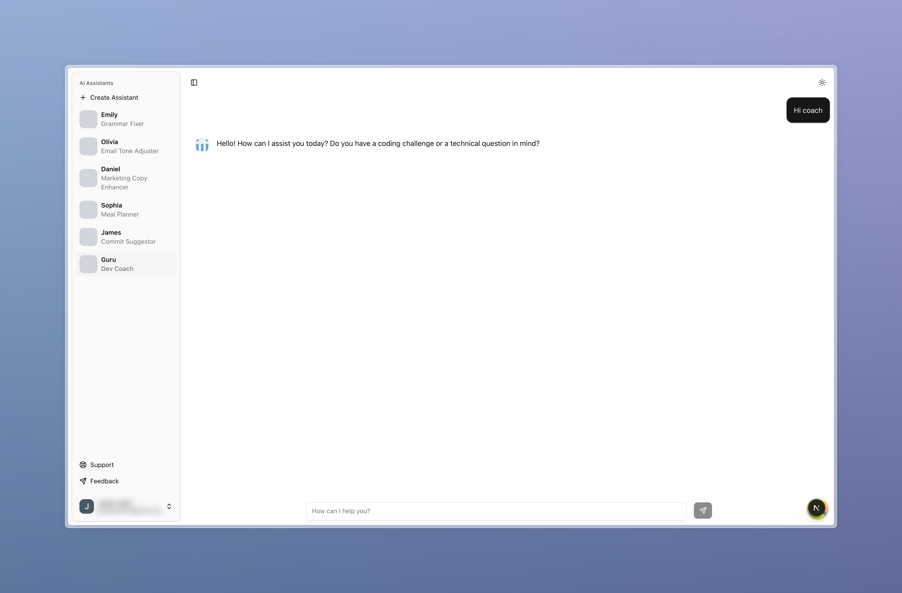

<p align="center">
  
</p>

<h1 align="center">
    AI Assistant
</h1>

<p align="center">
    Create a custom AI assistant for your needs.
</p>

<br/>

## ✅ Requirements
- Node.js (latest LTS version)
- Redis (for caching)
- PostgreSQL (for database)

## 💻 Tech Stack
- [TypeScript](https://www.typescriptlang.org/)
- [Next.js](https://nextjs.org/)
- [Tailwind CSS](https://tailwindcss.com/)
- [shadcn/ui](https://ui.shadcn.com/)
- [Zod](https://zod.dev/)
- [TanStack Query](https://tanstack.com/query/latest)
- [TanStack Form](https://tanstack.com/form/latest)
- [Redis](https://github.com/redis/node-redis)
- [OpenAI API](https://openai.com/api/)
- [Better Auth](https://www.better-auth.com/)
- [Drizzle ORM](https://orm.drizzle.team/)
- [PostgreSQL](https://www.postgresql.org/)

## 🌐 Environment Variables
Make sure to set the following environment variables in your `.env.local` file:
```
BETTER_AUTH_SECRET=

DATABASE_URL=postgresql://127.0.0.1:5432/db_name
DATABASE_LOGGER=true

GOOGLE_CLIENT_ID=
GOOGLE_CLIENT_SECRET=

OPENAI_API_KEY=

REDIS_URL=redis://localhost:6379
REDIS_TTL=300
```

## ⚙️ Running the App Locally
### 1. Clone the repository:
```
git clone https://github.com/jasonlerit/next-ai-assistant.git
cd next-ai-assistant
```
### 2. Install dependencies:
```
npm install
```
### 3. Start the development server:
```
npm run dev
```
